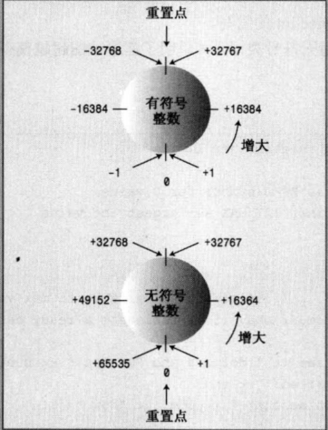

- [1. Learn\_CPP](#1-learn_cpp)
  - [1.1. github codespace 在线编辑](#11-github-codespace-在线编辑)
  - [1.2. 切换默认 CMakeLists.txt](#12-切换默认-cmakeliststxt)
- [2. 开始学习 C++](#2-开始学习-c)
- [3. 第三章 处理数据](#3-第三章-处理数据)
  - [3.1. 简单变量](#31-简单变量)
    - [3.1.1. 变量名（命名规则）](#311-变量名命名规则)
    - [3.1.2. 整型](#312-整型)
    - [3.1.3. 运算符 sizeof 和头文件 limits](#313-运算符-sizeof-和头文件-limits)
    - [3.1.4. 无符号类型](#314-无符号类型)
    - [3.1.5. 选择整型类型](#315-选择整型类型)
    - [3.1.6. 整型字面值](#316-整型字面值)
    - [3.1.7. C++常亮类型](#317-c常亮类型)
    - [3.1.8. char 类型：字符和小整数](#318-char-类型字符和小整数)
    - [3.1.9. bool 类型](#319-bool-类型)
  - [3.2. const 限定符](#32-const-限定符)
  - [3.3. 浮点数](#33-浮点数)
    - [3.3.1. 书写浮点数](#331-书写浮点数)
    - [3.3.2. 浮点类型](#332-浮点类型)
    - [3.3.3. 浮点常量](#333-浮点常量)
    - [3.3.4. 浮点常量的优缺点](#334-浮点常量的优缺点)
  - [3.4. C++算术运算符](#34-c算术运算符)
    - [3.4.1. 运算符优先级和结合性](#341-运算符优先级和结合性)
    - [3.4.2. 除法分支](#342-除法分支)
    - [3.4.3. 求模运算符](#343-求模运算符)
    - [3.4.4. 类型转换](#344-类型转换)
  - [3.5. C++11 中的 auto 声明（第 9 章）](#35-c11-中的-auto-声明第-9-章)
- [4. 复合类型](#4-复合类型)
  - [4.1. 数组](#41-数组)
    - [4.1.1. 数组初始化规则](#411-数组初始化规则)
    - [4.1.2. C++11 数组初始化方法](#412-c11-数组初始化方法)
  - [4.2. 字符串](#42-字符串)
    - [4.2.1. 拼接字符串常量](#421-拼接字符串常量)
    - [4.2.2. 在数组中使用字符串](#422-在数组中使用字符串)
    - [4.2.3. cin](#423-cin)
    - [4.2.4. 每次读取一行字符串输入](#424-每次读取一行字符串输入)
    - [4.2.5. 混合输入字符串和数字](#425-混合输入字符串和数字)
  - [4.3. string 类](#43-string-类)
    - [4.3.1. C++11 字符串初始化](#431-c11-字符串初始化)
    - [4.3.2. 赋值、拼接和附加](#432-赋值拼接和附加)
    - [4.3.3. string 类的其他操作](#433-string-类的其他操作)
    - [4.3.4. string 类 I/O](#434-string-类-io)
    - [4.3.5. 其他形式的字符串字面值](#435-其他形式的字符串字面值)
  - [4.4. 结构简介](#44-结构简介)
    - [4.4.1. 在程序中使用结构](#441-在程序中使用结构)
    - [4.4.2. C++11 结构体初始化](#442-c11-结构体初始化)
    - [4.4.3. 结构体可以将 string 类作为成员吗？可以！](#443-结构体可以将-string-类作为成员吗可以)
    - [4.4.4. 其他结构属性](#444-其他结构属性)
    - [4.4.5. 结构数组](#445-结构数组)
    - [4.4.6. 结构体中的位字段](#446-结构体中的位字段)
  - [4.5. 共用体](#45-共用体)
  - [4.6. 枚举体](#46-枚举体)
    - [4.6.1. 设置枚举量的值](#461-设置枚举量的值)
    - [4.6.2. 枚举的取值范围](#462-枚举的取值范围)
  - [4.7. 指针和自由存储空间](#47-指针和自由存储空间)
    - [4.7.1. 声明和初始化指针](#471-声明和初始化指针)
    - [4.7.2. 指针的危险](#472-指针的危险)
    - [4.7.3. 指针和数字](#473-指针和数字)
    - [4.7.4. 使用new来分配内存](#474-使用new来分配内存)
    - [4.7.5. 使用delete释放内存](#475-使用delete释放内存)
    - [4.7.6. 使用new创建动态数组](#476-使用new创建动态数组)
  - [4.8. 指针、数组和指针算术](#48-指针数组和指针算术)
    - [4.8.1. 指针和字符串](#481-指针和字符串)
    - [4.8.2. 使用new创建动态结构](#482-使用new创建动态结构)
    - [4.8.3. 分配内存的方法：自动存储、静态存储、动态存储和线程存储](#483-分配内存的方法自动存储静态存储动态存储和线程存储)

<style>  
  .right-link {  
    float: right;  
    margin-left: 10px; /* 可选：添加间距 */  
  }  
</style>

# 1. Learn_CPP

## 1.1. github codespace 在线编辑

- 打开 github 仓库地址，直接按下 **.**，即可打开 githu 的 VSCode 在线打开
- 打开后在运行调试点击运行，可创建 codespace

## 1.2. 切换默认 CMakeLists.txt

- 打开根目录下的.vscode/settings.json

* [settings.json](./.vscode/settings.json)

- 更改参数，运行根目录下 clean 脚本，即可重新运行
- "cmake.sourceDirectory": "/workspaces/Learn_CPP/4/4_1_arrayone"

<a href="#1-Learn_CPP" class="right-link">↥ back to top</a>

# 2. 开始学习 C++

# 3. 第三章 处理数据

## 3.1. 简单变量

### 3.1.1. 变量名（命名规则）

1. 只能使用字母字符、数字和下划线（\_）
2. 名称的第一个字符不可以是数字
3. 区分大小写
4. 不能使用 C++关键字
5. 以两个下划线或下划线和大写字母打头的名称被保留给实现（编译器及其使用的资源）使用。以一个下划线开头的名称被保留给实现，用作全局标识符
6. C++名称长度没有限制，但是有些平台有限制

<a href="#1-Learn_CPP" class="right-link">↥ back to top</a>

### 3.1.2. 整型

### 3.1.3. 运算符 sizeof 和头文件 limits

1. sizeof(同 C 语言)
   - 对类型名使用 sizeof 运算符时，应将**类型名放在括号里**
   - 对变量名使用 sizeof 运算符时，**括号是可选的**
2. 头文件 climits

| 符号变量   | 表示                        |
| ---------- | --------------------------- |
| CHAR_BIT   | char 的位数                 |
| CHAR_MAX   | char 的最大值               |
| CHAR_MIN   | char 的最小值               |
| SCHAR_MAX  | signed char 的最大值        |
| SCHAR_MIN  | signed char 的最小值        |
| UCHAR_MAX  | unsigned char 的最大值      |
| SHRT_MAX   | short 的最大值              |
| SHRT_MIN   | short 的最小值              |
| USHRT_MAX  | unsigned short 的最大值     |
| INT_MAX    | int 的最大值                |
| INT_MIN    | int 的最小值                |
| UINT_MAX   | unsigned int 的最大值       |
| INT_MAX    | int 的最大值                |
| INT_MIN    | int 的最小值                |
| UINT_MAX   | unsigned int 的最大值       |
| LONG_MAX   | long 的最大值               |
| LONG_MIN   | long 的最小值               |
| ULONG_MAX  | unsigned long 的最大值      |
| LLONG_MAX  | long long 的最大值          |
| LLONG_MIN  | long long 的最小值          |
| ULLONG_MAX | unsigned long long 的最大值 |

1. 符号常量

- 被设计用来 C 和 C++的头文件必须使用#define
- C++使用关键之 const 方式创建符号常量

1. 初始化

- 将变量初始化为字面值常量
- 将变量初始化为另一个变量，条件是后者已经定义过
- 将变量初始化为表达式，条件是当程序执行到该声明时，表达式中的所有值都是已知的。

1. C++11 初始化方式

```c {.line-numbers}
   int i = {0};
   int i{0};   // 可以不需要等号
   int i = {}; // 初始化为0
   int i{};
```

- 有助于更好的防范类型转换错误
- 使新手更容易学习 C++
  <a href="#1-Learn_CPP" class="right-link">↥ back to top</a>

### 3.1.4. 无符号类型

- 关键字 unsigned
- C++确保了无符号类型超越限制时不出错
- C++并不保证整型超越限制（上溢和下溢）时不出错
  

<a href="#1-Learn_CPP" class="right-link">↥ back to top</a>

### 3.1.5. 选择整型类型

- 节省一点就是赢得一点
  <a href="#1-Learn_CPP" class="right-link">↥ back to top</a>

### 3.1.6. 整型字面值

| 进制    | 说明                                                      |
| ------- | --------------------------------------------------------- |
| 10 进制 | 如果第一位为 1~9                                          |
| 8 进制  | 如果第一位为 0，第二位为 1~7                              |
| 16 进制 | 如果前两位为 0x 或 0X。字符 a ~ f 和 A ~ F 表示十六进制位 |

- 输出十六进制和十进制。在修改格式之前，原来格式将一直有效

| 进制    | 代码        |
| ------- | ----------- |
| 10 进制 | cout << dec |
| 8 进制  | cout << oct |
| 16 进制 | cout << hex |

<a href="#1-Learn_CPP" class="right-link">↥ back to top</a>

### 3.1.7. C++常亮类型

- 整型常量默认 int
- 后缀：
  - u 表示 unsigned
  - l 表示 long
  - ul 表示 unsigned long
  - ll 表示 long long
- 长度：
  - 对于不带后缀的十进制，按照 int、long、long long 的顺序查找最长的匹配类型
  - 对于不带后缀的八进制和十六进制，按照 unsigned int、unsigned int、unsigned long、unsigned long long 的顺序查找最长的匹配类型
    <a href="#1-Learn_CPP" class="right-link">↥ back to top</a>

### 3.1.8. char 类型：字符和小整数

1. 值的类型将引导 cout 选择如何显示值
2. 成员函数 cout.put()。为什么会有这个成员函数，是历史遗留问题。
3. char 字面值
   - 单引号
   - 转义字符
   - 转义序列
4. 通用字符名
   - 通用字符名以\u 开头，后面是 16 进制数
   - 通用字符名可以用于任何字符
5. char 默认，既不是没符号，也不是有符号。有需要情况下，需要显示指出。
6. wchar_t
   - 宽字符类型
   - 与 underlying 类型长度和符号属性相同
   - cin 和 cout 是 char 流，所有不适于处理 wchar_t
   - wcin 和 wcout 处理 wchar_t
   - 前缀 L 指示宽字符常量和宽字符串
7. char16_t 和 char32_t
   - 无符号类型
   - u 前缀表示 char16_t
   - U 前缀表示 char32_t
     <a href="#1-Learn_CPP" class="right-link">↥ back to top</a>

### 3.1.9. bool 类型

- **非 0 即 1**
- true 转换成 1，false 转换成 0
- 任何数字值或指针值都可以被隐式转换成 bool（即不用显式强制转换）
  <a href="#1-Learn_CPP" class="right-link">↥ back to top</a>

## 3.2. const 限定符

1. const 声明常量
2. const 相较于#define 的**优势**：
   - 明确指定类型
   - 使用 C++作用域将定义限制在特定的函数或者文件中
   - 可以用于更复杂的类型，如数组和结构
     <a href="#1-Learn_CPP" class="right-link">↥ back to top</a>

## 3.3. 浮点数

- 数值和缩放因子
  <a href="#1-Learn_CPP" class="right-link">↥ back to top</a>

### 3.3.1. 书写浮点数

- 标准小数表示法（也允许使用,做小数点）
- E 表示法（也可以使用 e）
  d.ddE+n
  d.ddE-n
  d.dde+n
  -d.ddE+n

### 3.3.2. 浮点类型

1. 浮点类型

   - float、double、long double
   - floa：32 位，指数范围至少-37 到+37
   - double：64 位，指数范围至少-37 到+37
   - long double：96 位，指数范围至少-37 到+37
   - 在头文件 cfloat 或 float.h 中可以找到系统的限制。
   - 有些 C++实现未添加头文件 cfloat，有些基于 ANSI C 之前的编译器的 C++实现未添加头文件 float.h。

2. cout.setf()方法
   - cout 默认会删除结尾 0，调用 cout.setf()会覆盖这个行为
   - 调用 cout.setf(ios_base::fixed, ios_base::floatfield)会保留小数点后的 0
   - 调用 cout.setf(ios_base::scientific, ios_base::floatfield)会使用科学计数法

<a href="#1-Learn_CPP" class="right-link">↥ back to top</a>

### 3.3.3. 浮点常量

- 默认浮点常量都是 double 类型
- 希望浮点常量是 float 类型，需要在数字后面加上 f 或 F
- 对于 long double 类型，需要在数字后面加上 l 或 L
  <a href="#1-Learn_CPP" class="right-link">↥ back to top</a>

### 3.3.4. 浮点常量的优缺点

1. 优点
   - 可以表示整数之间的值
   - 因为有缩放因子，所有可以表示的范围大得多
2. 缺点
   - 运算速度慢
   - 精度将降低

<a href="#1-Learn_CPP" class="right-link">↥ back to top</a>

## 3.4. C++算术运算符

- \+ 运算符
- \- 运算符
- \* 运算符
- / 运算符
- % 运算符：
  - 求模
  - 操作数只能是整数
  - 如果操作数其中一个是负数，则满足如下规则：(a/b)\*b + a%b = a
    <a href="#1-Learn_CPP" class="right-link">↥ back to top</a>

### 3.4.1. 运算符优先级和结合性

1. 优先级
2. 结合性(方向)
   <a href="#1-Learn_CPP" class="right-link">↥ back to top</a>

### 3.4.2. 除法分支

1. 两个操作数都是整数，则结果为整数
2. 其中一个或者两个为小数，则结果为浮点数
   <a href="#1-Learn_CPP" class="right-link">↥ back to top</a>

### 3.4.3. 求模运算符

1. 求模运算符的结果是整数
   <a href="#1-Learn_CPP" class="right-link">↥ back to top</a>

### 3.4.4. 类型转换

1. C++自动执行类型转换
   - 将一种算术类型的值赋给另一种算术类型的变量时,C++将对值进行转换
   - 表达式中包含不同的类型时,C++将对值进行转换;
   - 将参数传递给函数时,C++将对值进行转换。
2. 初始化和赋值进行的转换
3. 以{}方式初始化时进行的转换（C++11）
   - 大括号的初始化称为列表初始化
   - 列表初始化不允许**缩窄**
   - 且列表初始化需要**常量**
     ```c {.line-numbers}
     const int code = 66;
     int x=66;
     char c1 {31325}; // 缩窄，不被允许
     char c2 = {66}; // 可以，因为存的下
     char C3 {code}; // 可以，因为存的下
     char C4 = {x}; // 不可以，因为x不是常量
     X = 31325;
     char c5 = x; // 这样的初始化是可以的
     ```
4. 表达式中的转换
   - 出现时自动转换
     - **整型提升：**
       - 在计算表达式时,C++将 bool、char、unsigned char、signed char 和 short 值转换为 int
       - 如果 short 比 int 短,则 unsigned short 类型将被转换为 int;如果两种类型的长度相同,则 unsignedshort 类型将被转换为 unsigned int。
   - 有些类型与其他类型同时出现在表达式时将被转换
5. 传递参数时的转换：传递参数时的类型转换通常由 C++函数原型控制。
6. 强制类型转换：
   - 强制转换的通用格式如下:
     - (typeName) value // 来自 C 语言
     - typeName (value) // 纯粹的 C++
   - 4 个强制类型转换运算符（15 章介绍） \* static_cast\<typeName> (value) 可用于将值从一种数值类型转换为另一种数值类型
     <a href="#1-Learn_CPP" class="right-link">↥ back to top</a>

## 3.5. C++11 中的 auto 声明（第 9 章）

- 如果使用关键字 auto,而不指定变量的类型,编译器将把变量的类型设置成与初始值相同:
  <a href="#1-Learn_CPP" class="right-link">↥ back to top</a>

# 4. 复合类型

## 4.1. 数组

- 数组声明：
  1. 存储在每个元素中的值的类型;
  2. 数组名;
  3. 数组中的元素数。编译时已知
- 数组使用：
  1. 可以单独访问数组元素。使用下标或者索引。
  2. 从 0 开始
  3. 编译器不会检查使用发下标是否有效

<a href="#1-Learn_CPP" class="right-link">↥ back to top</a>

### 4.1.1. 数组初始化规则

1. 只有在定义数组时才能使用初始化,此后就不能使用了
2. 不能将一个数组赋给另一个数组
3. 初始化数组时,提供的值的个数可以少于数组的元素数目。
4. 如果只对数组的一部分进行初始化,则编译器将把其他元素设置为 0。
5. 如果初始化数组时方括号内([])为空,C++编译器将计算元素个数
   <a href="#1-Learn_CPP" class="right-link">↥ back to top</a>

### 4.1.2. C++11 数组初始化方法

列表初始化

- 初始化数组时,可省略等号(=)
- 可不在大括号内包含任何东西,这将把所有元素都设置为零
- 列表初始化禁止缩窄转换
  <a href="#1-Learn_CPP" class="right-link">↥ back to top</a>

## 4.2. 字符串

1. C 风格字符串
   - 以空字符结尾，空字符被写作'\0'
   - 字符数组初始化为字符串方法：
     - 显式加上空字符
     - 使用双引号括起的字符串（字符串常量或字符串字面值）
   - 字符串读入 char 数组中时，会自动加上空字符
   - 字符串常量不能与字符常量互换
2. 基于 string 类库
   <a href="#1-Learn_CPP" class="right-link">↥ back to top</a>

### 4.2.1. 拼接字符串常量

- 任何两个由空白(空格、制表符和换行符)分隔的字符串常量都将**自动拼接**成一个。
  <a href="#1-Learn_CPP" class="right-link">↥ back to top</a>

### 4.2.2. 在数组中使用字符串

1. 将数组初始化为字符串常量
2. 将键盘或文件输入读入到数组中
3. 确认字符串长度(只计算可见字符长度)-strlen()

- [4_2_string.cpp](./4/4_2_string/src/4_2_string.cpp)

### 4.2.3. cin

- [4_3_instr1.cpp](./4/4_3_instr1/src/4_3_instr1.cpp)

* cin 使用空白(空格、制表符和换行符)来确定字符串的结束位置，且**空白符会保存在输入队列**
* cin 在获取字符数组输入时，只读取一个单词
* cin 开始输入之前它们跳过空白（空格、换行符和制表符）
*

<a href="#1-Learn_CPP" class="right-link">↥ back to top</a>

### 4.2.4. 每次读取一行字符串输入

1. 面向行的输入：**cin.getline(字符数组名, 字符个数, 结束标志)**
   - [4_4_instr2.cpp](./4/4_4_instr2/src/4_4_instr2.cpp)
   * 字符个数包括不可见字符
   * 默认使用换行符作为结束标志
   * 不读入输入的字符串的结束标志（如换行符）
   * **结束符不会保存在输入队列**
2. 面向行的输入：**cin.get**
   - [4_5_instr3.cpp](./4/4_5_instr3/src/4_5_instr3.cpp)
   * cin.get(char\* s, streamsize n)：会读取到行尾，但是**换行符会保存在输入队列**
   * cin.get():可读取下一个字符（即使是换行符）
   * cin.get(char\* s, streamsize n).get():消耗掉输入队列的换行符
   * 为什么使用 get()而不是 getline()？
     - 老式未实现 getline
     - get 使输入更仔细。比如如何知道停止读取的原因是已经读取一整行了还是数组填满了?可以使用 cin.get()查看下一个输入字符，如果下一个输入字符是换行符，则说明已经读取了一整行。
3. 空行和其他问题
   - 空行：
     - 最初做法：下一条输入语句将在前一条 getline()或 get()结束读取的位置开始读取
     - 当前做法：当 get()（不是 getline()）读取空行后将设置时效为（failbit），之后输入将被阻断。使用 cin.clear()来恢复输入。
   - 其他问题： \* 输入行包含的字符数比指定的多，get()和 getline()将把余下字符留在输入队列，而 getline()会设置失效位，并关闭之后输入。
     <a href="#1-Learn_CPP" class="right-link">↥ back to top</a>

### 4.2.5. 混合输入字符串和数字

- 当混合输入数字和字符串时，需注意数字会把换行符留在输入队列中
  <a href="#1-Learn_CPP" class="right-link">↥ back to top</a>

## 4.3. string 类

- [4_7_strtype1.cpp](./4/4_7_strtype1/src/4_7_strtype1.cpp)

* C++98 添加
* 需包含头文件 string，string 类位于命名空间 std 中
* string 对象和字符数数组区别：
  - 可以将 string 对象声明为简单变量而不是数组
  - 类设计可以让程序**自动处理**string 的大小
    <a href="#1-Learn_CPP" class="right-link">↥ back to top</a>

### 4.3.1. C++11 字符串初始化

### 4.3.2. 赋值、拼接和附加

- [4_8_strtype2.cpp](./4/4_8_strtype2/src/4_8_strtype2.cpp)

* 可以将一个 string 对象赋值给另一个 string 对象，而数组不可以
* 可以使用+合并两个 string 对象，可以使用+=追加
* 可以将 C 风格字符串或 string 对象与 string 对象相加，或将他们附加到 sting 对象的末尾
  <a href="#1-Learn_CPP" class="right-link">↥ back to top</a>

### 4.3.3. string 类的其他操作

- [4_9_strtype3.cpp](./4/4_9_strtype3/src/4_9_strtype3.cpp)

* 对于 c 风格字符串，使用 cstring 中的函数完成操作
* string 对象相较于 c 风格字符数组优势：
  - 处理时语法更简单
  - 字符数组总是存在目标数组过小，无法存储指定信息的危险
  - string 类具有自动调整大小的功能
  - c 风格字符串，提供**strncat()和 strncpy()**，可以指定目标数组最大允许长度
    <a href="#1-Learn_CPP" class="right-link">↥ back to top</a>

### 4.3.4. string 类 I/O

- [4_10_strtype4.cpp](./4/4_10_strtype4/src/4_10_strtype4.cpp)

* 处理 string 对象的代码使用 string 类的一个友元函数

### 4.3.5. 其他形式的字符串字面值

| 字符类型 | 字面值前缀 | 标准  |
| -------- | ---------- | ----- |
| char     |            |       |
| wchar_t  | L          |       |
| char16_t | u          | C++11 |
| char32_t | U          | C++11 |

- C++11 新增：
  - UTF-8 使用 u8 前缀
  - 原始（raw）字符串：
    _ R 前缀（即不再转义，界定符为 **"(** 和 **)"**）
    _ 允许支持自定义界定符：
    _ 如：\*\*"+_(** 和 **)+_"\*\*
    _ 默认界定符之间添加任意数量的基本字符，但空格、括号、斜杠和控制字符除外
    <a href="#1-Learn_CPP" class="right-link">↥ back to top</a>

## 4.4. 结构简介

- 创建结构：
  - 定义结构描述
  - 创建结构变量
- C++允许在声明结构体变量时省略关键字 struct
  <a href="#1-Learn_CPP" class="right-link">↥ back to top</a>

### 4.4.1. 在程序中使用结构

- [4_11_structur.cpp](./4/4_11_structur/src/4_11_structur.cpp)

* C++不提倡使用外部变量，但是提倡使用外部结构体声明。另外在外部声明符号常量通常更合理
  <a href="#1-Learn_CPP" class="right-link">↥ back to top</a>

### 4.4.2. C++11 结构体初始化

- 列表初始化，且等号可选
- 若大括号未包含任何东西，每个成员被设置为零
- 不允许缩窄转换
  <a href="#1-Learn_CPP" class="right-link">↥ back to top</a>

### 4.4.3. 结构体可以将 string 类作为成员吗？可以！

```c++ {.line-numbers}
#include <string>
struct inflatable
{
  std::string name;
  float volume;
  double price;
};
```

<a href="#1-Learn_CPP" class="right-link">↥ back to top</a>

### 4.4.4. 其他结构属性

- 可以作为函数参数或者返回值
- 可以使用赋值运算符将整个结构体赋值给另一个结构体变量（成员赋值）
- 可以同时完成定义结构体和创建结构体变量
- 可以声明没有名称的结构体类型
  <a href="#1-Learn_CPP" class="right-link">↥ back to top</a>

### 4.4.5. 结构数组

### 4.4.6. 结构体中的位字段

- 允许指定占用特定位数的结构体成员
- 字段的类型应该为整型或者枚举，接下来是冒号，冒号后面是一个数字，它指定了使用的位数
- 可以使用没有名称的字段来提供间距
- 每个成员都被称为位字段

```c++ {.line-numbers}
struct torgle_register
{
  unsigned int SN : 4;  // 4 bits for SN value
  unsigned int : 4;     // 4 bits unused
  bool goodIn : 1;      // valid input (1 bit)
  bool goodTorgle : 1;  // successful torgling
}
```

<a href="#1-Learn_CPP" class="right-link">↥ back to top</a>

## 4.5. 共用体

- 能存储不同数据类型，但是同时只能存储其中一种类型
- 共用体长度为起最大成员的长度

## 4.6. 枚举体

- 创建符号常量
- 代替 const
- 允许定义新类型，但必须按严格的限制进行
- 枚举体，枚举量
- 默认将整数值赋给枚举量，可以显式的指定整数值来覆盖默认值
- 枚举变量具有一些特殊属性：
  - 在不进行强制类型转换的情况下，只能将定义枚举时使用的枚举量赋值给这种枚举的变量
  - 对于枚举，只定义了赋值运算符，没有定义算术运算符
  - 枚举量是整型，可被提升为 int 类型，但 int 不能自动转换成枚举类型
  - 如果 int 值有效，则可以通过强制类型转换将 int 值赋给枚举变量
    <a href="#1-Learn_CPP" class="right-link">↥ back to top</a>

### 4.6.1. 设置枚举量的值

- [4_0_6_1_enum.cpp](./4/4_0_6_1_enum/src/4_0_6_1_enum.cpp)

1. 可以使用赋值运算符显式地给枚举量赋值
2. 指定的值，必须是整数
3. 也可以显式地定义其中一些枚举量的值。默认从零开始。后面未定义的值，比前面枚举量大 1。
4. 可以创建多个值相同的枚举量
   <a href="#1-Learn_CPP" class="right-link">↥ back to top</a>

### 4.6.2. 枚举的取值范围

1. 上限：
   1. 最大值的最小 2 次幂减 1。如 101->128->127
2. 下限：
   1. 最小值不小于 0，则下限为 0
   2. 最小值小于 0，最大值的最小 2 次幂减 1 加上负号。如-6 -> -8 -> -7
      <a href="#1-Learn_CPP" class="right-link">↥ back to top</a>

## 4.7. 指针和自由存储空间
- 显示地址时，cout 使用十六进制
- 常规变量：值是指定的量，地址是派生量
- <b>*</b>运算符：间接值或解除引用运算符
- [4_14_address.cpp](./4/4_14_address/src/4_14_address.cpp)
- [4_15_pointer.cpp](./4/4_15_pointer/src/4_15_pointer.cpp)
<a href="#1-Learn_CPP" class="right-link">↥ back to top</a>

### 4.7.1. 声明和初始化指针
- \* 运算符两边空格可选
- 每个指针变量名都需要使用一个\*。如：int \*p1, \*p2
- int *是一种复合类型
- 指向不同类型的指针变量长度相同
- 在声明时初始化指针，被初始化的是指针而不是它指向的值
[4_16_init_ptr.cpp](./4/4_16_init_ptr/src/4_16_init_ptr.cpp)

### 4.7.2. 指针的危险
* 创建指针时，并不会分配用来存储指针所指向数据的内存

### 4.7.3. 指针和数字
* 将数字值作为地址使用，应当通过强制类型转换为适当的地址类型，否则会报错
  
### 4.7.4. 使用new来分配内存
* 数据对象：为数据项分配的内存块
* 为一个数据对象获得并指定分配内存的通用格式：
  > typeName * pointer_name = new typeName;

- [4_17_use_new.cpp](./4/4_17_use_new/src/4_17_use_new.cpp)
* 必须声明指针所指向的类型：地址本身只指出了对象存储地址的开始，而没有指出其类型（使用的字节数）
* new分配的内存块通常和常规变量声明分配的内存块不同
  * 常规变量在栈
  * new从堆或者自由存储区分配内存
* 值为0的指针被称为空指针

### 4.7.5. 使用delete释放内存
* 使用delete，后面加上指向new分配的内存的指针
* 释放内存后，并不会删除指针本身
* 一定要成对使用new和delete，否则会发生内存泄漏
* 使用delete的关键，将它用于new分配的内存。不一定非是new的指针变量，如不同指针指向同一个new的内存的情况
* 一般来说，不要创建两个指向同一内存的指针，因为这将增加错误删除同一内存块两次的可能性。

### 4.7.6. 使用new创建动态数组
* 对于大型数据（如数组，字符串和结构体），应当使用new
* 动态联编
* 静态联编
* 动态数组
1. 使用new创建动态数组
```c++ {.line-numbers}
int *p = new int [10]; // 返回第一个元素地址
delete [] p;
```
* new和delete遵循以下规则：
  * 不能用delete释放不是new分配的内存
  * 不要尝试释放已经释放的内存，结果未知
  * 如果使用new[]为数组分配内存，则必须使用delete[]释放内存
  * 如果使用new为单个对象分配内存，则必须使用delete（没有方括号）释放内存
  * 对空指针使用delete是安全的
* 不能用sizeof运算符确定动态分配的数组包含的字节数
2. 使用动态数组
[4_18_arraynew.cpp](./4/4_18_arraynew/src/4_18_arraynew.cpp)

## 4.8. 指针、数组和指针算术
* 指针和数组基本等价的原因在于指针算术和C++内部处理数组的方式
* C++将数组名解释为地址
* 指针变量加1，其增加的值等于指向的类型占用的字节数
* arr[1]，C++编译器将该表达式看作是 *(arr + 1)
* 通常使用数组表示法，C++都执行下面转换
  * arr[i] 转换成  *(arr + i)
* 使用的是指针，而不是数组名，C++也执行下面转换
  * p[i] 转换成  *(p + i)
* 数组名和指针名区别：
  1. 可以修改指针的值，而数组名是常量
  2. 对数组应用sizeof运算符得到的是数组的长度，而对指针得到的是指针的长度，即使指针指向的是一个数组
* 数组的地址
  > int arr[10];
  1. 对数组取地址时，数组名并不会被解释为其地址
  2. 数组名解释为第一个元素的地址
  3. 对数组名取地址得到的是整个数组的地址
  4. 从数字上来说是一样，但从概念上讲&arr[0]（即arr），是一个4字节内存块的地址，而&arr，是一个40字节内存块的地址
  5. 表达式arr+1，将地址值加2
  6. 表达式&arr+1，将地址加40
  7. arr是一个int指针（int *）
  8. &arr是一个，指向包含指向10个元素的int数组（int (*)[10]）
  > int (*p)[10] = &arr;
### 4.8.1. 指针和字符串
* 如果给cout提供一个字符的地址，则它会从该字符开始打印，直到遇到空字符为止
* 在C++中，用引号括起的字符串像数组名一样，也是第一个元素的地址
[4_20_ptrstr.cpp](./4/4_20_ptrstr/src/4_20_ptrstr.cpp)
* 一般给cout提供一个指针，它将打印地址
* 但如果指针类型是char *，cout将显示指向的字符串
* 如果想要显示字符串的地址，则必须将这种指针强制转换成另一种指针类型，如int *

### 4.8.2. 使用new创建动态结构
* 本节关于结构体的也适用于类
* new创建结构，需同时使用结构体类型和new
  > m_struct * ps = new m_struct;
* 结构体指针访问成员
  1. 使用 <b>-></b>，如ps->m_mem;
  2. 使用(*ps).m_mem;

### 4.8.3. 分配内存的方法：自动存储、静态存储、动态存储和线程存储
* C++11新增的线程存储，将在第9章简要讨论
* 自动存储：
  1. 在函数内部定义的常规变量使用自动存储空间
  2. 是局部变量
  3. 作用域为包含它的代码块
  4. 存储在栈中
* 静态存储：
  1. 静态存储是整个程序执行期间都存在的存储方式
  2. 静态变量
     1. 函数外定义的变量
     2. 声明使用static关键字
  3. 第9章详细介绍
* 动态存储
  1. new和delete运算符提供了一种比自动变量和静态变量更灵活的方法。 
  2. 自由存储空间（free store） 或堆（heap）
  3. new和delete可以在一个函数中分配，而在另一个函数中释放
